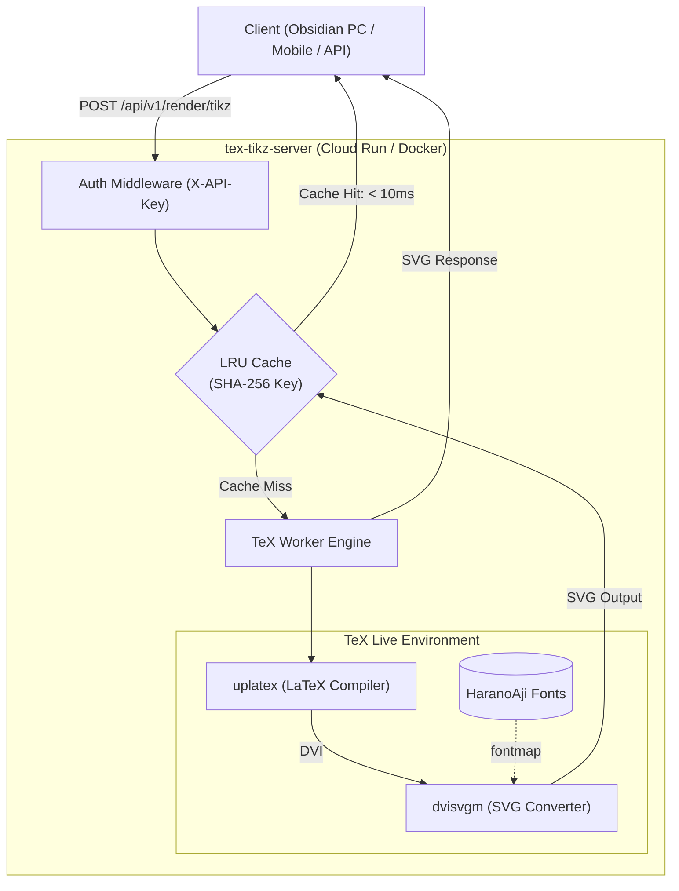

# tex-tikz-server

TikZ / LaTeX コードを高速かつ安全に SVG 形式へレンダリングする API サーバーです。  
GCP Cloud Run や Docker コンテナ上での動作に最適化されており、Obsidian プラグインや外部クライアントからマルチプラットフォーム(PC / モバイル)で利用できます。

---

## 主な特徴

- **高速 SVG レンダリング**: `uplatex` + `dvisvgm` により TikZ コードをベクター形式(SVG)へダイレクトに変換。
- **完全な日本語対応**: 原ノ味フォント(HaranoAji)をバンドルし、日本語テキストを含む図形も美しく出力。
- **SHA-256 LRU インメモリキャッシュ**: 同一コードの再レンダリングをミリ秒単位(< 10ms)で即時返却。
- **スキーマ駆動開発 (OpenAPI 3.1)**: 単一の OpenAPI 定義から Go サーバーコードおよび TypeScript 型定義を自動生成。
- **セキュアなサンドボックス実行**: コマンド実行時のシェルエスケープ禁止(`-no-shell-escape`)と一時作業領域の完全隔離。

---

## アーキテクチャ



---

## クイックスタート

### Docker Compose で起動

```bash
# サーバーの起動 (ポート 8080)
docker compose up -d
```

### Docker コマンドで起動

```bash
# イメージのビルド
docker build -t tex-tikz-server .

# コンテナの実行 (API_KEY を設定)
docker run -d -p 8080:8080 -e API_KEY=your_secret_key tex-tikz-server
```

---

## API 仕様

サーバー起動後、ブラウザで `http://localhost:8080/docs` にアクセスすると、対話型 API ドキュメント(Scalar / Swagger)を確認・検証できます。

### 1. ヘルスチェック

```bash
curl http://localhost:8080/health
```

**レスポンス例:**
```json
{
  "status": "ok",
  "version": "1.0.0"
}
```

### 2. TikZ レンダリング

`POST /api/v1/render/tikz` に TikZ コードを送信します(認証ヘッダー `X-API-Key` が必須です)。

```bash
curl -X POST http://localhost:8080/api/v1/render/tikz \
  -H "Content-Type: application/json" \
  -H "X-API-Key: dev_secret_key_12345" \
  -d '{
    "code": "\\begin{tikzpicture}\n\\draw[thick, fill=blue!20] (0,0) circle (1.5cm);\n\\node at (0,0) {日本語テスト};\n\\end{tikzpicture}",
    "format": "svg",
    "timeout_ms": 10000
  }'
```

**リクエストパラメータ:**

| フィールド | 型 | 必須 | デフォルト | 説明 |
| :--- | :---: | :---: | :---: | :--- |
| `code` | string | **必須** | - | TikZ コード(`\begin{tikzpicture}...\end{tikzpicture}`) |
| `format` | string | 任意 | `svg` | 出力フォーマット(現在は `svg` のみ) |
| `preamble` | string | 任意 | - | 追加の LaTeX パッケージや TikZ ライブラリ指定 |
| `timeout_ms` | integer | 任意 | `10000` | コンパイルタイムアウト(ミリ秒) |

**レスポンス例 (`200 OK`):**
```json
{
  "status": "success",
  "format": "svg",
  "svg": "<svg xmlns=\"http://www.w3.org/2000/svg\" ...>...</svg>",
  "cached": false,
  "hash": "a1b2c3d4...",
  "compile_time_ms": 320
}
```

---

## 環境変数

設定は環境変数で行います(`.env.example` を参照)。

| 変数名 | 必須 | デフォルト値 | 説明 |
| :--- | :---: | :--- | :--- |
| `PORT` | 任意 | `8080` | サーバー待受ポート |
| `API_KEY` | **必須** | - | クライアント認証用 API キー |
| `CACHE_SIZE` | 任意 | `2000` | インメモリ LRU キャッシュの最大保持件数 |
| `EXEC_TIMEOUT_SEC` | 任意 | `10` | 1 リクエストあたりの最大コンパイル秒数 |
| `FONT_DIR` | 任意 | `fonts` | 日本語フォント配置ディレクトリパス |

---

## 開発・運用コマンド

`Makefile` に各種タスクが定義されています。

```bash
# OpenAPI スキーマから Go サーバーコードを自動生成
make gen

# OpenAPI スキーマから TypeScript クライアント型定義を生成
make gen-ts

# 単体テスト / 結合テスト / E2E テストの実行
make test
make test-e2e

# ベンチマーク・負荷テストの実行
make bench

# コンテナ起動からレンダリングまでの自動検証
make test-container
```

---

## GCP Cloud Run へのデプロイ

```bash
gcloud run deploy tex-tikz-server \
  --source . \
  --platform managed \
  --region asia-northeast1 \
  --allow-unauthenticated \
  --set-env-vars API_KEY="your_production_api_key",CACHE_SIZE="5000" \
  --memory 1Gi \
  --cpu 1 \
  --concurrency 10
```
